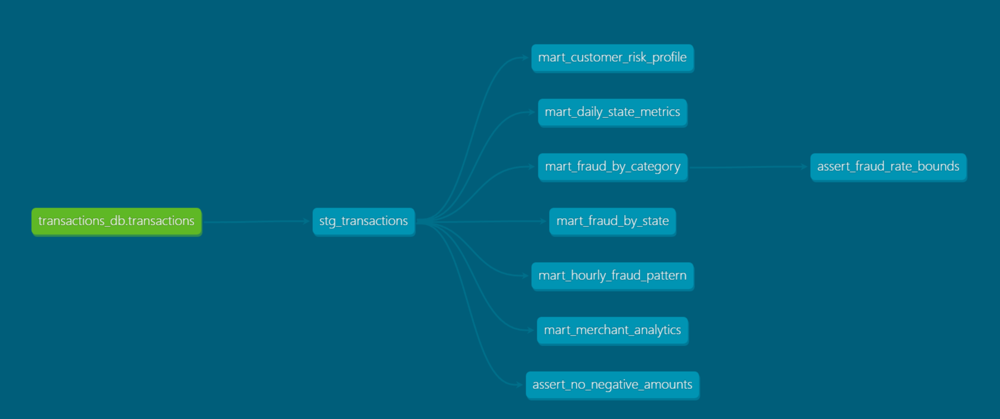

### Requirements
- Python 3.11
- dbt-core 1.11.x
- dbt-clickhouse 1.9.x
- ClickHouse (Docker)
- Docker Compose
- PowerShell

### Getting started
```bash
git clone https://github.com/kre1ses/dbt_project.git
cd dbt_project
```

0. Place your CSV file or dowload train.csv from here (https://www.kaggle.com/competitions/teta-ml-1-2025/data?select=train.csv) to "./data/" folder

(For Windows Users) Create a profiles.yml in C:\Users\<username>\.dbt\profiles.yml
```yaml
clickhouse:
  target: dev
  outputs:
    dev:
      type: clickhouse
      host: localhost
      port: 8123
      user: click
      password: click
      database: transactions_db
```

1. Install requirements:
```bash
pip install dbt-core dbt-clickhouse
```

2. Run docker container:
```bash
docker-compose up -d clickhouse
```

3. Start database:
```bash
Get-Content clickhouse/init.sql | docker exec -i dbt_project-clickhouse-1 clickhouse-client
Get-Content clickhouse/load_data.sql | docker exec -i dbt_project-clickhouse-1 clickhouse-client
```

(Optional) How to debug:
```bash
cd dbt
dbt debug
```

4. Run dbt:
```bash
cd dbt
dbt deps
dbt run
dbt test
```

5. Create Documentation:
```bash
dbt docs generate 
dbt docs serve
```

For task:
1. Versions
```bash
Core:
  - installed: 1.11.2
  - latest:    1.11.2 - Up to date!

Plugins:
  - clickhouse: 1.9.7 - Up to date!
```
2. Test logs:
```bash
00:25:18  Running with dbt=1.11.2
00:25:18  Registered adapter: clickhouse=1.9.7
00:25:19  Found 7 models, 8 data tests, 1 source, 867 macros
00:25:19  
00:25:19  Concurrency: 1 threads (target='dev')
00:25:19
00:25:20  1 of 8 START test accepted_values_stg_transactions_is_fraud__0__1 .............. [RUN]
00:25:20  1 of 8 PASS accepted_values_stg_transactions_is_fraud__0__1 .................... [PASS in 0.57s]
00:25:20  5 of 8 PASS dbt_utils_unique_combination_of_columns_mart_daily_state_metrics_transaction_date__us_state  [PASS in 0.06s]
00:25:20  6 of 8 START test dbt_utils_unique_combination_of_columns_mart_fraud_by_category_category  [RUN]
00:25:21  6 of 8 PASS dbt_utils_unique_combination_of_columns_mart_fraud_by_category_category  [PASS in 0.05s]
00:25:21  7 of 8 START test not_null_stg_transactions_amount ............................. [RUN]
00:25:21  7 of 8 PASS not_null_stg_transactions_amount ................................... [PASS in 0.05s]
00:25:21  8 of 8 START test not_null_stg_transactions_transaction_time ................... [RUN]
00:25:21  8 of 8 PASS not_null_stg_transactions_transaction_time ......................... [PASS in 0.05s]
00:25:21
00:25:21  Finished running 8 data tests in 0 hours 0 minutes and 1.90 seconds (1.90s).
00:25:21
00:25:21  Completed successfully
00:25:21
00:25:21  Done. PASS=8 WARN=0 ERROR=0 SKIP=0 NO-OP=0 TOTAL=8
```

3. DAG screenshot:


4. List of tables and tests:

Tables:

- mart_daily_state_metrics — states daily metrics

- mart_fraud_by_category — analysis of frod by categories

- mart_fraud_by_state — frod distribution over states

- mart_customer_risk_profile — client risk-profile

- mart_hourly_fraud_pattern — frod patterns in time

- mart_merchant_analytics — merchant analytics

Tests:

- not_null, unique, accepted_values on columns

- dbt_utils.unique_combination_of_columns on tables

- singular tests (assert_no_negative_amounts, assert_fraud_rate_bounds)